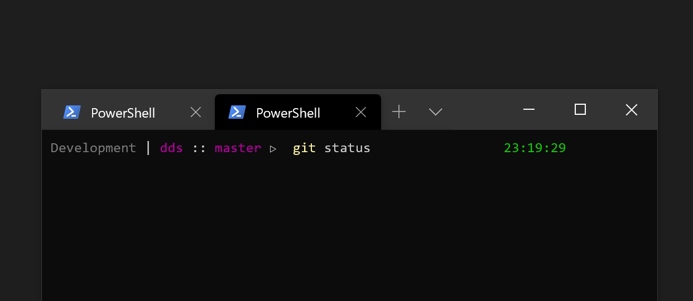

# PowerShell custom prompt and other scripts

## Custom prompt

- Used for both Windows and Linux subsystem
- Current directory
- A dynamic "main directory" used to specify the context
- Git branch
- Current time
- Last command success/failure
- Admin user label

